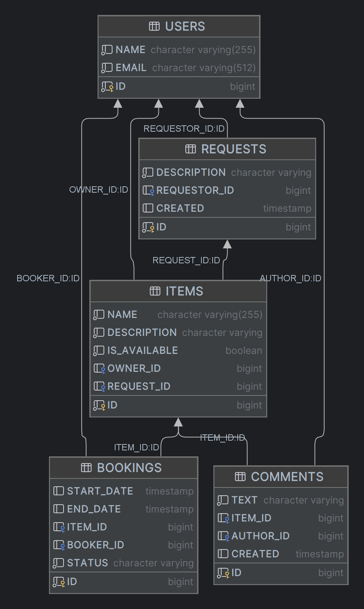

# java-shareit
***Сервис для шеринга вещей.***
Сервис даёт пользователям возможность рассказывать, какими вещами они готовы поделиться, а так же находить нужную вещь и брать её в аренду на время.

*Веб сервис написан на Java 11 на базе Spring Boot, имеет многомодульную структуру.
В разработке использованы REST API, PostgreSQL, Hibernate ORM, Lombok, Docker*

Пользователь, который добавляет в приложение новую вещь, считается ее владельцем.
При добавлении вещи есть возможность указать её краткое название и добавить небольшое описание.
Для поиска вещей организован поиск. Чтобы воспользоваться нужной вещью, её требуется забронировать.
Бронируется вещь всегда на определённые даты. Владелец вещи обязательно должен подтвердить бронирование.
После того как вещь возвращена, у пользователя, который её арендовал, есть возможность оставить отзыв.
Ещё одна возможность сервиса — запрос вещи ItemRequest. Пользователь создаёт запрос, если нужная ему вещь не найдена
при поиске. В запросе указывается, что именно он ищет. В ответ на запрос другие пользователи могут добавить нужную вещь.

## Схема базы данных

Запустить сервис можно в IntelliJ IDEA:
- выполнив docker-compose.yml (для запуска в Docker)
- или выполнить java-shareit/server/src/main/resources/schema.sql -> "run"(для инициализации БД),
  затем поочерёдно запустить модули «server» (основной сервис) и «gateway» (шлюз) выполнив:
    * java-shareit/server/src/main/java/ru/practicum/shareit/ShareItApp -> "run";
    * java-shareit/gateway/src/main/java/ru/practicum/shareit/ShareItGateway -> "run";

